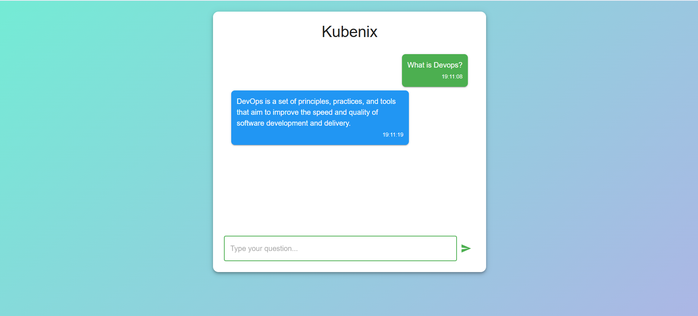

# 🚀 Kubenix – End-to-End CI/CD on AWS EKS

Kubenix is a **production-style DevOps project** that demonstrates a complete **CI/CD pipeline, Kubernetes orchestration, autoscaling, monitoring, and infrastructure automation** on AWS.

All workflows are fully automated using **GitHub Actions**, from infrastructure provisioning to application deployment.



---

## 🧠 Project Summary

- **Frontend**: React application  
- **Backend**: Python-based chat application  
- **Platform**: AWS EKS  
- **CI/CD**: GitHub Actions  
- **Infrastructure**: Terraform  
- **Autoscaling**: HPA, KEDA, Cluster Autoscaler  
- **Monitoring**: Prometheus & Grafana  
- **Security**: Trivy & SonarQube  

---

## 📂 Repository Structure

```text
.github/workflows/
├── frontend.yml            # Frontend CI
├── backend.yml             # Backend CI
├── frontend-deploy.yml     # Frontend deployment to EKS
├── backend-deploy.yml      # Backend deployment to EKS
├── infra-deploy.yml        # AWS infrastructure via Terraform
└── k8s.yml                 # Kubernetes bootstrap (Helm installs)
```

---

## 🔁 CI/CD Workflow Explained

### 1️⃣ Frontend CI (`frontend.yml`)

**Trigger:**  
- Any change in the `frontend/` directory

**Pipeline steps:**
- Install dependencies
- Run **Trivy** vulnerability scan
- Run **SonarQube** code quality scan
- Build Docker image
- Push image to Docker Hub **only if scans pass**

---

### 2️⃣ Backend CI (`backend.yml`)

**Trigger:**  
- Any change in the `backend/` directory

**Pipeline steps:**
- Dependency installation
- Trivy container scan
- SonarQube static analysis
- Docker image build
- Push image to Docker Hub **only on successful scans**

---

### 3️⃣ Infrastructure Provisioning (`infra-deploy.yml`)

Creates AWS infrastructure using **Terraform**, including:

- VPC & networking
- EKS cluster
- Managed node groups (On-Demand & Spot)
- IAM roles and policies

---

### 4️⃣ Kubernetes Bootstrap (`k8s.yml`)

Sets up the Kubernetes cluster using **Helm**:

- Metrics Server
- Cluster Autoscaler
- KEDA
- Prometheus
- Grafana

---

### 5️⃣ Application Deployment

**Files:**
- `frontend-deploy.yml`
- `backend-deploy.yml`

**Features:**
- Kubernetes rolling updates
- Zero-downtime deployments
- Image-based releases from CI pipeline

---

## 📈 Autoscaling Strategy

- **HPA**: CPU & memory-based pod scaling  
- **KEDA**: Queue/event-driven scaling (scale-to-zero supported)  
- **Cluster Autoscaler**: Node-level scaling  

Designed to handle:
- No-traffic scenarios
- Sudden traffic spikes
- Cost-efficient scaling using Spot nodes

---

## 📊 Monitoring & Observability

- **Prometheus** collects cluster and application metrics
- **Grafana** dashboards monitor:
  - CPU & memory usage
  - Pod & node health
  - Disk pressure
  - Autoscaling behavior

---

## 🔐 Security & Best Practices

- Trivy vulnerability scanning in CI
- SonarQube quality gates
- Infrastructure as Code (Terraform)
- Immutable Docker images
- Kubernetes-native deployments
- Least-privilege IAM roles

---

## 🎯 Purpose of This Project

This project demonstrates **real-world DevOps skills**, including:

- CI/CD pipeline design
- Kubernetes production patterns
- Autoscaling strategies
- Monitoring and observability
- Secure cloud infrastructure automation